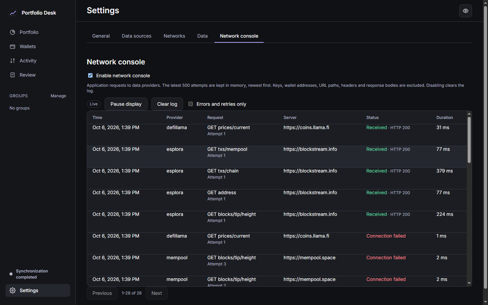

# Automatic provider reserves — 0.1.6

Implementation [PR #18](https://github.com/kurasis/CoinControl/pull/18), free-plan/reconnect corrections [#19](https://github.com/kurasis/CoinControl/pull/19), credential error protection [#20](https://github.com/kurasis/CoinControl/pull/20), and keyless pricing/recovery acceptance [#21](https://github.com/kurasis/CoinControl/pull/21) are merged. Exact application source: [acb280dbe73c4b6c4b8ede81f8523516d9769cc9](https://github.com/kurasis/CoinControl/commit/acb280dbe73c4b6c4b8ede81f8523516d9769cc9), [main CI 37471182519](https://github.com/kurasis/CoinControl/actions/runs/37471182519). Later packaging/evidence changes do not alter this application payload.

**All six application/build jobs passed.** The independent live job failed on the external API restrictions detailed below. [Job provenance](CI_JOBS.json). Attempt 1 passed native recovery but the installer scenario stopped before upgrading: the pinned previous 0.1.0 application did not open its profile. [Original failure](PREVIOUS_INSTALLER_STARTUP_FAILURE.json) is retained. Attempt 2 reran only the installer and its dependent production-load job, on the same source, and both passed; the other successful jobs were retained. No acceptance assertion or startup target was relaxed.

| Scope                                                               | Result / evidence                                                                                                                                                                  |
| ------------------------------------------------------------------- | ---------------------------------------------------------------------------------------------------------------------------------------------------------------------------------- |
| Type/lint/Clippy, offline tests, frontend build, generated bindings | PASS; 172 deterministic Rust / 37 frontend tests; 18 live functions opt out in offline runs                                                                                        |
| Browser preview with mock IPC                                       | PASS; 24 combinations, 12 pages, 2 panels and bounded 10000-row virtual table; [report](BROWSER_LAYOUT_REPORT.json)                                                                |
| Native Windows / actual 125, 150, 200% display scale                | 26 PASS; [report](NATIVE_REPORT.json); [runtime](WEBVIEW_RUNTIME_REPORT.json)                                                                                                      |
| Production upgrade / uninstall                                      | 11 PASS; [report](INSTALLER_REPORT.json); exact synthetic portfolio/audit preservation with program-scoped network isolation                                                       |
| Production EXE/NSIS inspection                                      | 64 PASS; [report](RELEASE_REPORT.json); no native-e2e feature or credential sentinels in payload                                                                                   |
| Installed production startup / large UI / CSV                       | 12 PASS; [report](NATIVE_LOAD_REPORT.json); first normal 1567.90 ms, offline 969.50 / 823.00 / 840.50 ms, all within unchanged 2000 ms target                                      |
| Release-mode Store load                                             | PASS on Linux and Windows; 50 accounts / 500 assets / 100000 normalized legs; [Linux](PERFORMANCE_LINUX.json) / [Windows](PERFORMANCE_WINDOWS.json); cached query p95 below 300 ms |

The large dataset is synthetic normalized SQL evidence, not 100000 API downloads or CSV rows. Browser results are separate from native Windows evidence. Hosted Windows Server does not establish physical Windows 11 acceptance.

## Live providers

All five new repository secrets were available and exercised in Actions. This establishes their presence, not universal plan or credential validity. Desktop production uses Settings → Data sources and the OS credential store; secrets are not included in a ZIP or frontend.

| Provider       | Result                      | Direct suite requests | Observation                                                                                                                                                                                                                            |
| -------------- | --------------------------- | --------------------- | -------------------------------------------------------------------------------------------------------------------------------------------------------------------------------------------------------------------------------------- |
| mempool        | PASS                        | 5                     | Bounded read-only checks passed                                                                                                                                                                                                        |
| publicnode     | PASS                        | 22                    | solana token discovery limitation                                                                                                                                                                                                      |
| blockscout     | PASS                        | 9                     | Bounded read-only checks passed                                                                                                                                                                                                        |
| etherscan      | PASS                        | 3                     | Bounded read-only checks passed                                                                                                                                                                                                        |
| drpc           | FAIL / external restriction | 17                    | drpc eth_chainId: rate limited                                                                                                                                                                                                         |
| chainstack     | FAIL / external restriction | 1                     | chainstack getGenesisHash: credential rejected (HTTP 401)                                                                                                                                                                              |
| toncenter      | PASS                        | 2                     | Bounded read-only checks passed                                                                                                                                                                                                        |
| mirror-routing | PASS                        | 5                     | Bounded read-only checks passed                                                                                                                                                                                                        |
| helius         | PASS                        | 5                     | Bounded read-only checks passed                                                                                                                                                                                                        |
| alchemy        | FAIL / external restriction | 12                    | alchemy eth_chainId: network access forbidden (HTTP 403); alchemy eth_chainId: network access forbidden (HTTP 403); alchemy eth_chainId: network access forbidden (HTTP 403); alchemy eth_chainId: network access forbidden (HTTP 403) |
| zerion         | FAIL / external restriction | 0                     | HTTP 429 confirmed in sanitized CI output; the suite aborted before its first check                                                                                                                                                    |

[Full sanitized live report](live/LIVE_REPORT.md), [shared request counts](live/usage.json), [estimated credits](live/estimated-credits.json). Every provider remained at or below the shared 50-request ceiling, including suites/retries. Direct suite counts above differ from shared totals; for example Blockscout's 9 direct requests plus 5 engine-routing requests total 14. The full live job failed; no all-provider pass is claimed.

Blockscout passed Ethereum/Arbitrum/Optimism. The initial run's Base/Polygon HTTP 402 showed that those featured chains need a paid plan; the free adapter excludes them. Etherscan passed Ethereum/Arbitrum/Polygon. dRPC passed five EVM chains in this final run and hit throttling on BNB; its initial run had passed all six EVM chains. Its current Solana metadata has no free nodes, so Solana is excluded from this free adapter. PublicNode passed native balances on six EVM chains, Solana and TRON; SPL discovery on the public test wallet returned 403, so its Solana result retains native balance with an explicit token limitation. TON Center passed native/Jetton reads.

Chainstack still rejects the configured Solana credential with HTTP 401. Replace `CHAINSTACK_API_KEY` with the Solana mainnet node's complete HTTPS endpoint from Access and credentials; a management key or another chain's token cannot authorize that node. No endpoint/key is included in this report. Existing Alchemy access to Base/Arbitrum/Optimism/Polygon remains blocked with 403, and Zerion suites remain blocked with 429. No paid access or overage was enabled.

[Coverage, official contracts and reserves](../../PROVIDER_MIRRORS.md): balance reserves preserve cached history/fees/basis and expose `partial`/`balance_only`. A successful balance refresh is not complete indexed history. EVM RPC/Etherscan cover native and up to 20 already known token contracts; Blockscout has a capped discovery path. Unobserved assets stay stale and are not zeroed. BTC's independent mempool mirror retains Esplora history semantics.

## Initial failures and corrections

Initial source [d7f97aab119c368466dbf733f35ed09021704376](https://github.com/kurasis/CoinControl/commit/d7f97aab119c368466dbf733f35ed09021704376), [CI 37465492993](https://github.com/kurasis/CoinControl/actions/runs/37465492993), was not published. [Original live report](INITIAL_LIVE_REPORT.md), [installer failure](INITIAL_INSTALLER_REPORT.json), [native reconnect failure](INITIAL_NATIVE_REPORT.json) are retained.

The production upgrade fixture was synthetic, but the new public reserve refreshed its address with real chain data during launch. The corrected installer scenario isolates that executable's outbound networking, removes the firewall rule in finally, and keeps every original exact portfolio/audit assertion. Live provider checks remain separate.

The native reconnect scenario found a persisted transient-error cooldown after offline testing. An explicit Sync now now retries only connection/server failures immediately; automatic refresh keeps its cooldown, and manual refresh never bypasses Retry-After, authentication/plan rejection or hard budgets. Regression tests cover these distinctions. Solana reserves retain strict mainnet genesis validation; no unsupported free dRPC route bypasses it.

## Recovery and credential follow-up

The intermediate [463faf7 run](https://github.com/kurasis/CoinControl/actions/runs/37467935482) passed upgrade/production load but its native test still queried every historical provider error as a current account error. [Native failure](intermediate-463faf7/NATIVE_REPORT.json) and [load results](intermediate-463faf7/NATIVE_LOAD_REPORT.json) are retained. The corrected acceptance checks the same active-source selection as Store, its successful checkpoint, fresh balance, unchanged history, completion through the shipped native UI and the unchanged request ceiling. It records independent retained errors instead of erasing their pauses. The final report's `syncRecovery` shows one healthy Esplora account and a retired mempool connection error; actual native totals are Esplora 12, mempool 3 and DefiLlama 14, each below 50.

Successful public DefiLlama prices no longer produce a fabricated missing-optional-Live-Coin-Watch-key error. Unavailable prices remain unpriced and actual failed provider requests retain their diagnostics. The [native console screenshot](network-console-live.png) shows healthy completion with previous failed requests retained in the diagnostics.

A [negative control](SHORT_KEY_NEGATIVE_CONTROL.txt) demonstrated that an HTTP 422 body could echo a short test credential before correction. The new regression passes for all five keyed reserves after arbitrary error bodies are omitted; HTTP status and sanitized endpoint attribution remain. Console data remains bounded opt-in memory with no keys, wallet addresses, URL paths, headers or bodies.

[TON Center anonymous contract probe](TONCENTER_ANONYMOUS_REPORT.json): two HTTP reads without a key passed for an account and 119 Jetton wallets, with integer balance strings. This local contract probe is separate from secret-backed adapter verification in CI.

This remains an unsigned prerelease. Full release acceptance retains the actual API restrictions above and physical Windows 11 verification as explicit gates.

## Published Windows ZIP

[Download Windows x64 ZIP — v0.1.6](https://github.com/kurasis/CoinControl/releases/download/v0.1.6/CoinControl-0.1.6-windows-x64.zip). [Publisher 37474555540](https://github.com/kurasis/CoinControl/actions/runs/37474555540) passed, using the exact inspected installer and tested application payload. Re-downloaded ZIP CRC, four contents, internal/external checksums and source/installer matching passed. SHA-256: `2180e9be116c5b77ef627f2603abe241ad97a6cde56a935136a0c44442f1649f` (8108206 bytes). [Build manifest](BUILD_INFO.json) · [verification](PUBLISHED_ZIP_VERIFICATION.json). This remains an unsigned prerelease; API and physical Windows 11 gates above are explicit.
